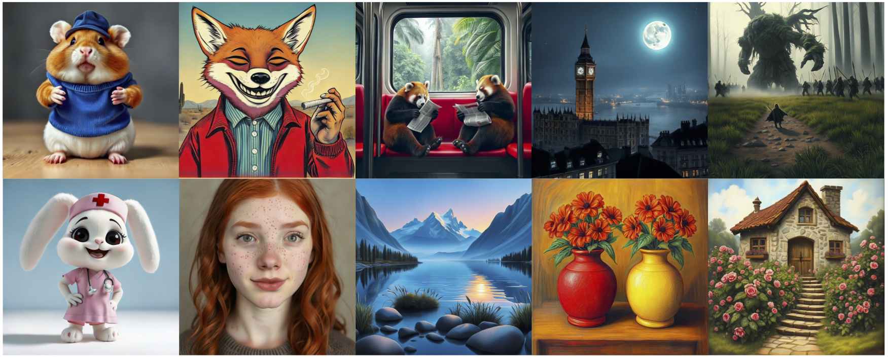

### Unifying Visual Understanding and Generation via Text-Aligned Representations
> [Jiaming Han](https://csuhan.com), [Hao Chen](https://haochen-rye.github.io)<sup>†</sup>, [Yang Zhao](https://scholar.google.com/citations?user=uPmTOHAAAAAJ&hl=zh-CN), [Hanyu Wang](https://hywang66.github.io), [Qi Zhao](https://kevinz8866.github.io), [Ziyan Yang](https://ziyanyang.github.io), [Hao He](https://hehao13.github.io), [Xiangyu Yue](https://xyue.io)<sup>‡</sup>, [Lu Jiang](https://www.lujiang.info)<sup>‡</sup>
>
> <sup>†</sup> Project Lead&nbsp;&nbsp;<sup>‡</sup> Corresponding Authors

 <a href="https://tar.csuhan.com">
    
  </a>
<a href="https://arxiv.org/abs/xxxx.xxxxx">
    
  </a>
  <a href="https://huggingface.co/collections/csuhan/tar-68538273b5537d0bee712648">
    
  </a>
  <a href="https://huggingface.co/spaces/csuhan/Tar">
    
  </a>



### News
- June 2025. We are applying for code open-sourcing and will release the code and model immediately once approved.


### Citation
```
@article{han2025tar,
  title={Vision as a Dialect: Unifying Visual Understanding and Generation via Text-Aligned Representations}, 
  author={Han, Jiaming and Chen, Hao and Zhao, Yang and Wang, Hanyu and Zhao, Qi and Yang, Ziyan and He, Hao and Yue, Xiangyu and Jiang, Lu},
  year={2025},
  archivePrefix={arXiv},
  primaryClass={cs.CV}
}
```

### License
This project is licensed under the [Apache 2.0 License](LICENSE).

