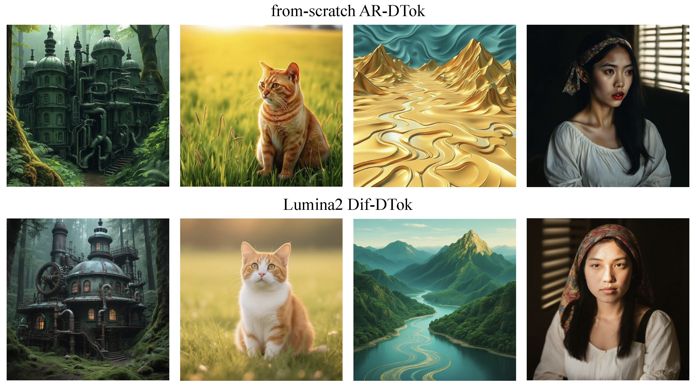

<div align="center">
<h1> Tar + Lumina2: Lumina-Image-2.0 as A Strong Dif-DTok</h1>
</div>

<p align="center">
 
 <br>
</p>

## 🏠 Architecture
✨ Lumina-Accessory directly leverages the self-attention mechanism in DiT to perform interaction between condition and target image tokens, consistent with approaches such as [OminiControl](https://github.com/Yuanshi9815/OminiControl), [DSD](https://primecai.github.io/dsd/), [VisualCloze](https://github.com/lzyhha/VisualCloze), etc.

✨ Built on top of Lumina-Image-2.0, Lumina-Accessory introduces an additional condition processor, initialized with the weights of the latent processor.

✨ We pass TA-Tok's discrete tokens to Lumina-Accessory for transforming text-aligned representation into the pixel space with high quality. We made minor modifications to Lumina-Accessory, such as iterative parquet dataset loading and TA-Tok condition support.


## 💻 Finetuning Code
### 1. Create a conda environment and install PyTorch
```bash
conda create -n Lumina2 -y
conda activate Lumina2
conda install python=3.11 pytorch==2.1.0 torchvision==0.16.0 torchaudio==2.1.0 pytorch-cuda=12.1 -c pytorch -c nvidia -y
```
### 2.Install dependencies
```bash
pip install -r requirements.txt
```
### 3. Install flash-attn
```bash
pip install flash-attn --no-build-isolation
```
### 4. Prepare data

We suggest to use parquet dataset for loading large scale training data. Check [csuhan/ImageNet1K-T2I-QwenVL-QwenImage](https://huggingface.co/datasets/csuhan/ImageNet1K-T2I-QwenVL-QwenImage) for example.

### 5. Start finetuning
```bash
bash scripts/run_1024_finetune_tatok.sh
```
## 🚀 Inference Code
Please check the inference script in the main branch.